# E-Commerce Management System `C++`
This project is a project of the end of the second academic year of `Data Structures (INF 270)`.

## Features

* For **Admin** :
  * show sellers information and products.
  * Delete a seller or product if it violates system policies.
  * Delete any product.
  * Modify account data.

* For **Seller** :
  * Create a new account.
  * Add products.
  * Edit or delete a product.
  * Modify account data.
* For **Customer** :
  * Browse products easily as products are divided into categories.
  * The ability to search for a product.
  * The possibility of buying more than one product.
  * Print the purchase invoice.

## Requirements

* C++14

  

## Installation

* Add files without changing the location, as it can result in some code errors.
* We recommend using a codeblocks to run the code.

## Default data

* For **Admin** :	

    | Email | Password |
    | :---: | :------: |
    | admin |  admin   |

* For **Seller** :	

    |         Email         | Password |
    | :-------------------: | :------: |
    | seller01@commerce.com | 01010101 |
    | seller02@commerce.com | 02020202 |
    | seller03@commerce.com | 03030303 |

And there are 22 products added.

## Some Screenshots

* Main Pages :

  |               Home                |                  Login                   |
  | :-------------------------------: | :--------------------------------------: |
  |   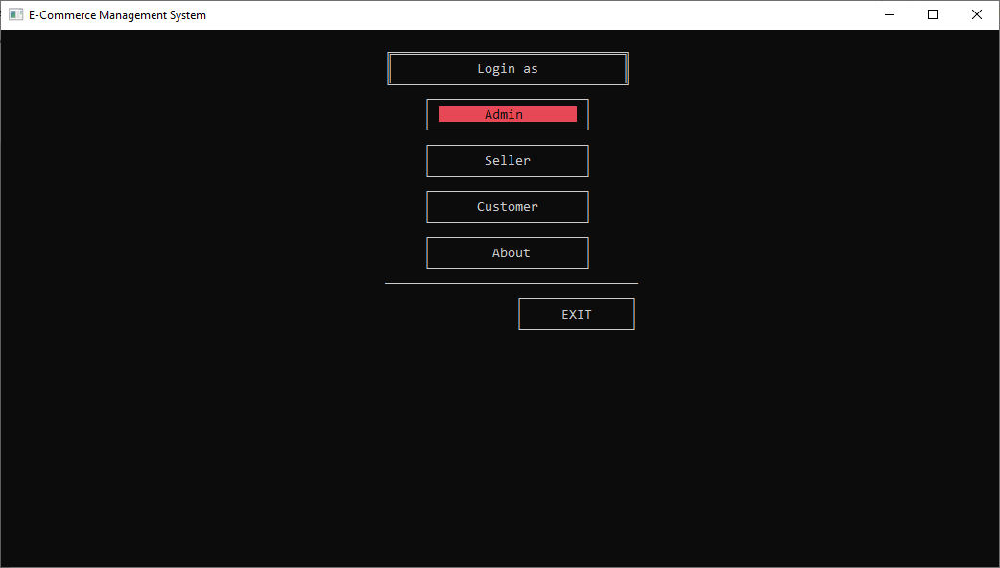   |           |
  |        **Register seller**        |           **Customer  login**            |
  | 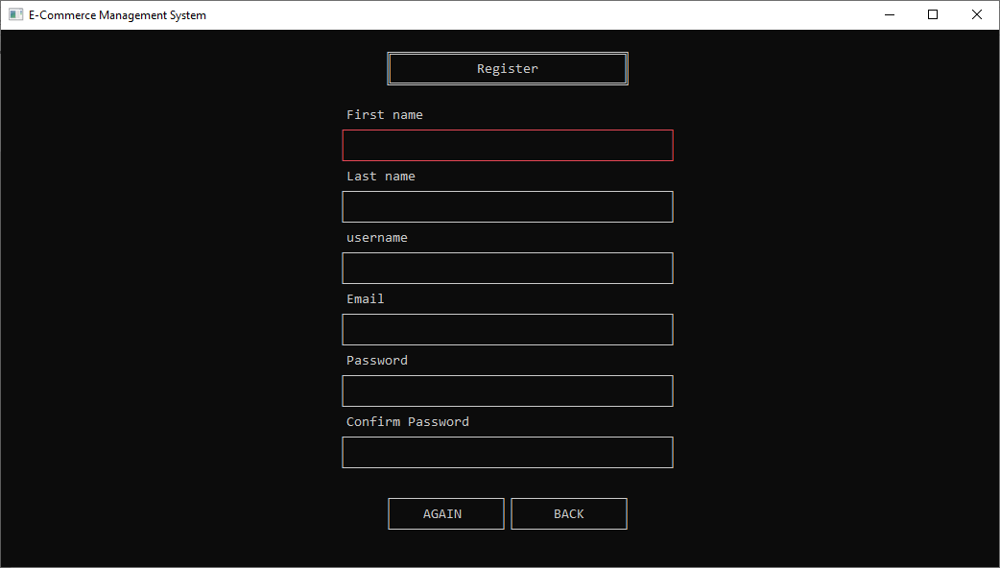 | 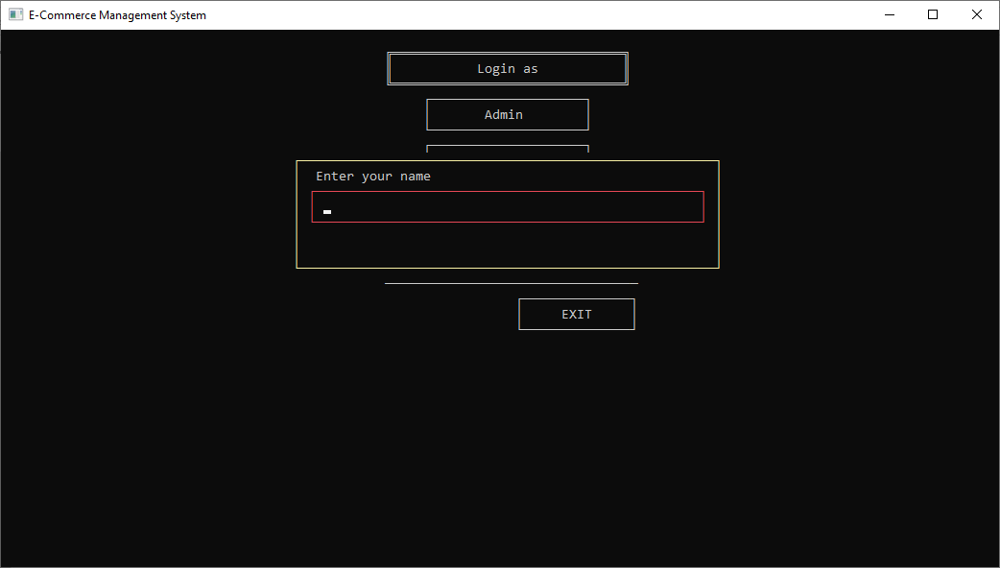 |

* Admin Interface :

  |                       Admin Interface                        |                        Admin Profile                         |
  | :----------------------------------------------------------: | :----------------------------------------------------------: |
  |          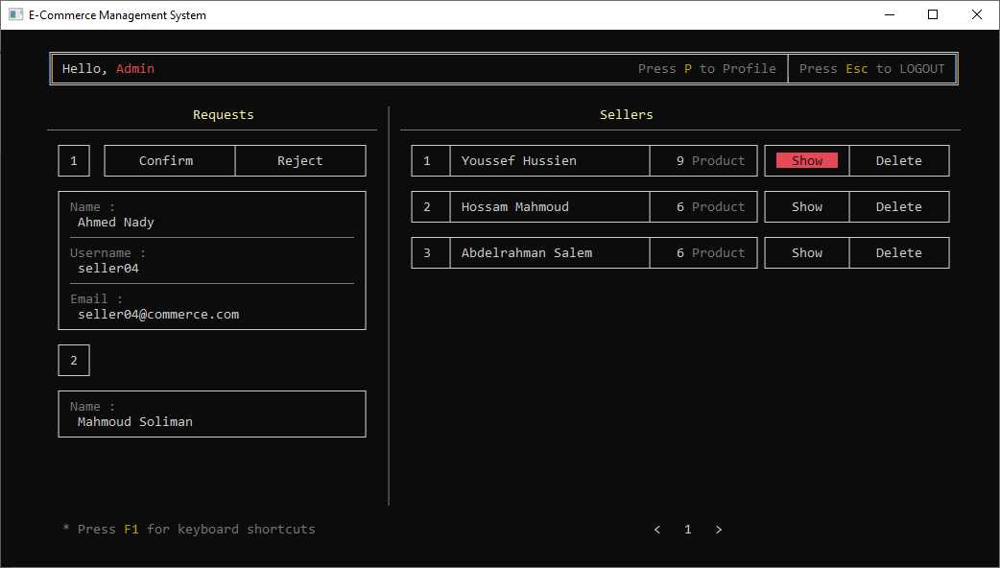           |       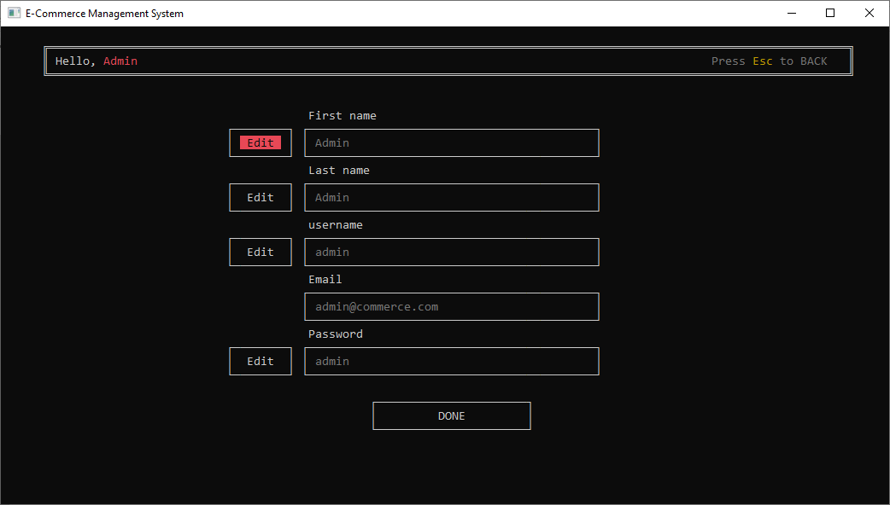        |
  |                   **Show Seller by Admin**                   |                  **Show Product by Admin**                   |
  | 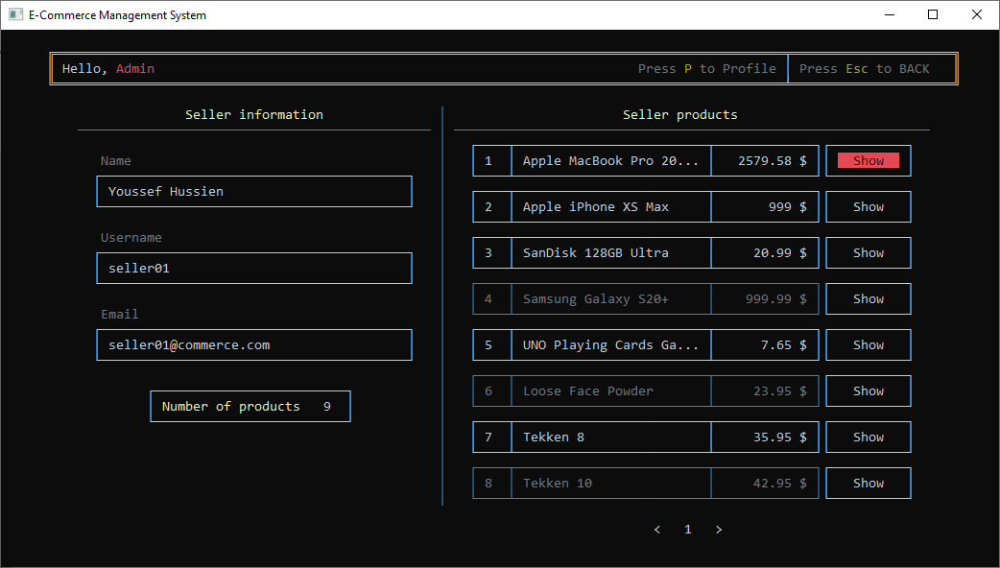 | 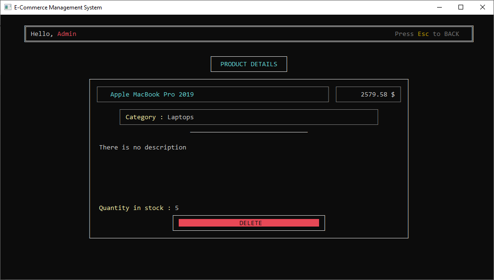 |

* Seller Interface :
  
  |             Seller (01) Interface             |                     Show Product                     |
  | :-------------------------------------------: | :--------------------------------------------------: |
  |     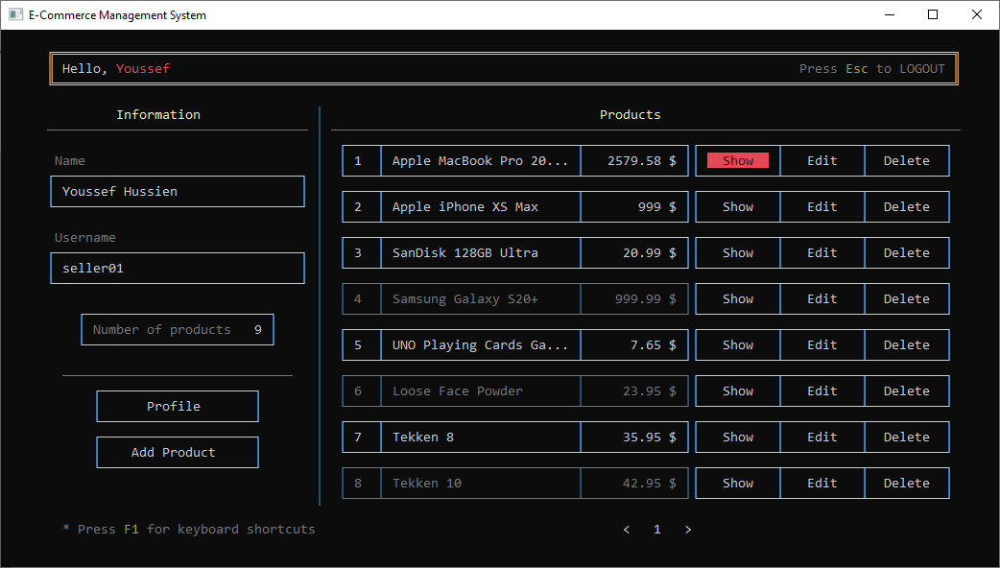      | 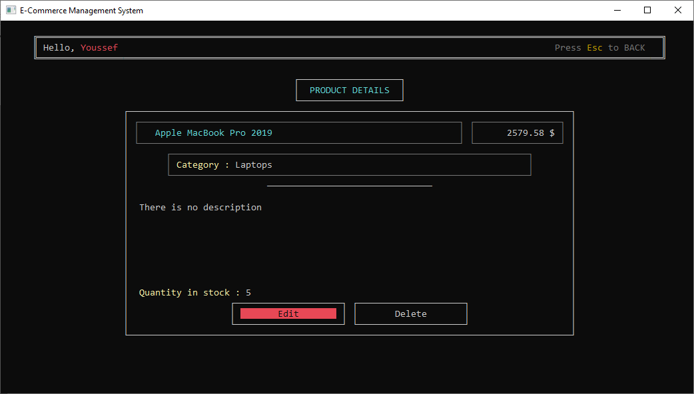 |
  |               **Edit Product**                |                   **Add Product**                    |
  | 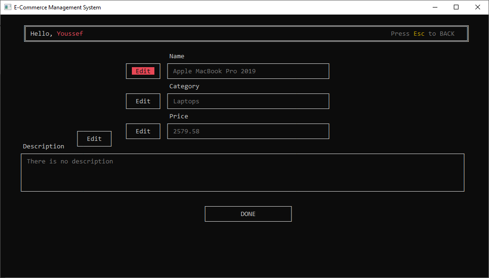 |     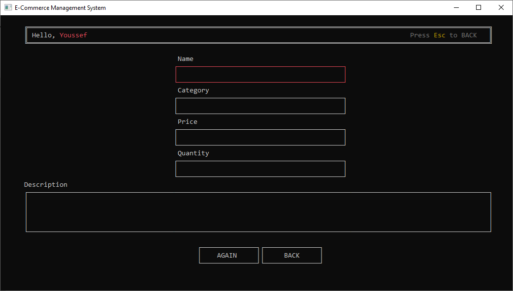      |

* Customer Interface :

  |                   Customer Interface                    |                     Show All Categories                     |
  | :-----------------------------------------------------: | :---------------------------------------------------------: |
  |     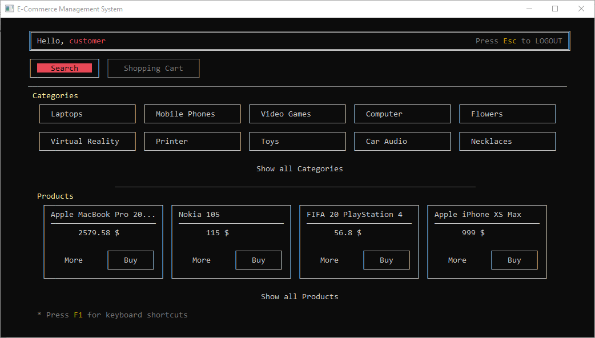     | 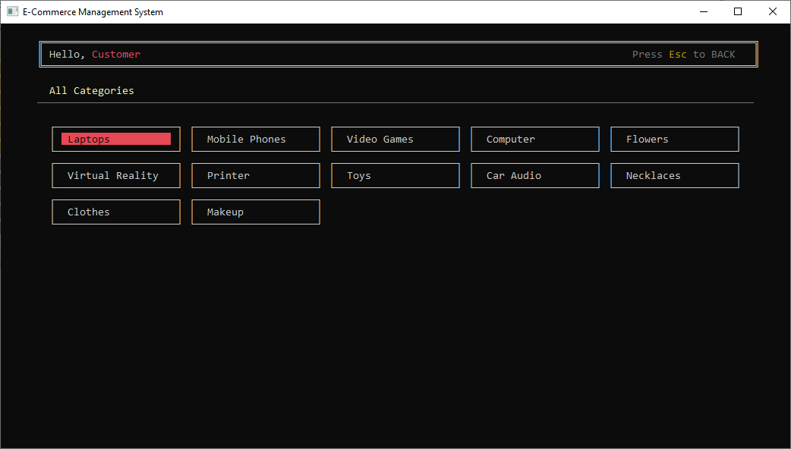 |
  |                  **Show All Products**                  |                         **Search**                          |
  |  |              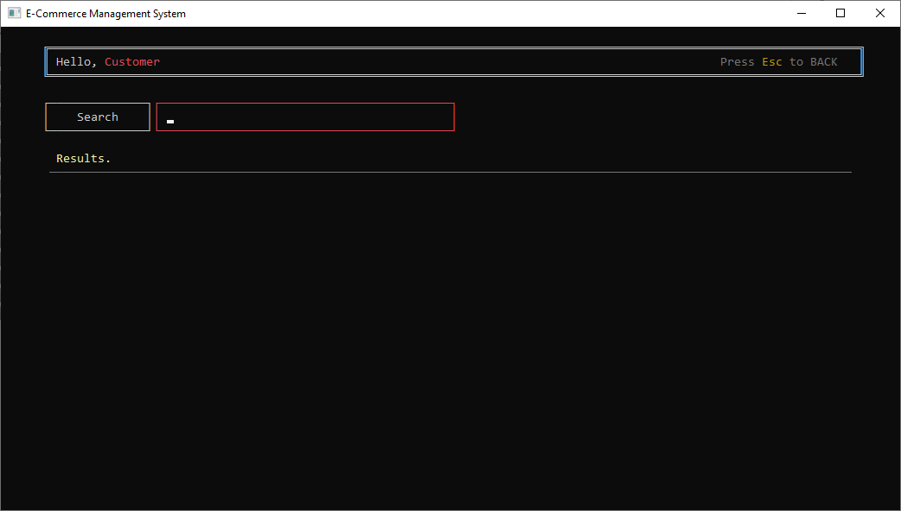              |
  |                   **Search Results**                    |                      **Show Product**                       |
  |    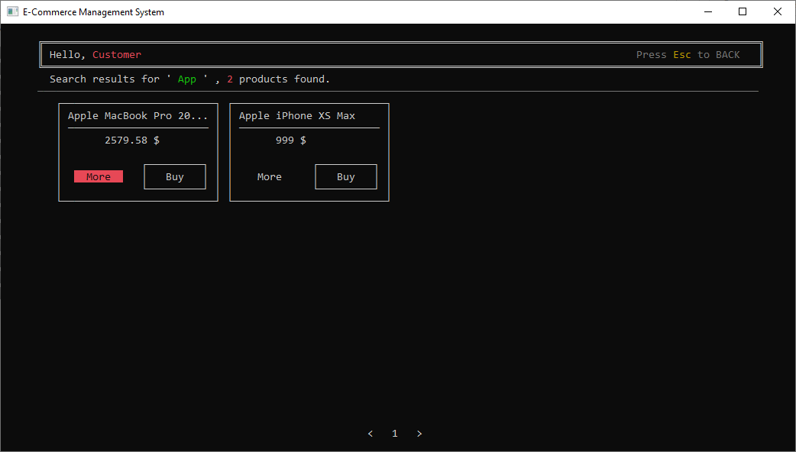    |       |
  |                    **Shopping Cart**                    |                  **Complete The Purchase**                  |
  |     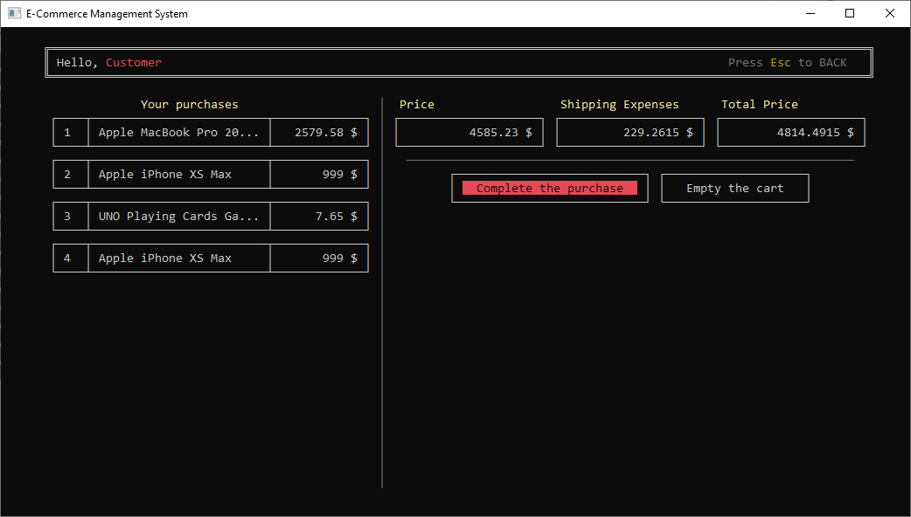     | 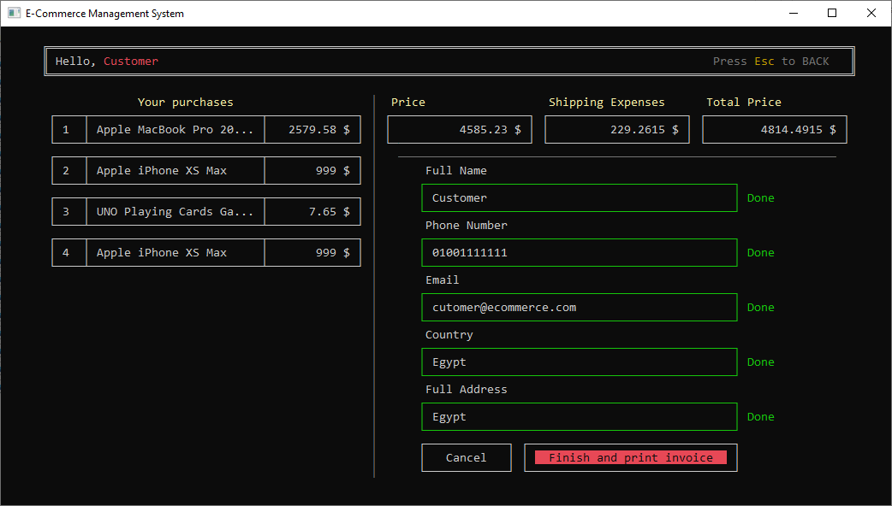 |
  |                       **Invoice**                       |                                                             |
  |             |                                                             |

## Contributors

  |                   youssef7ussien                   |                     M-Soliman2000                 |
  | :------------------------------------------------: | :-----------------------------------------------: |
  |     [Profile](https://github.com/youssef7ussien)   |         [Profile](https://github.com/M-Soliman2000)  |
